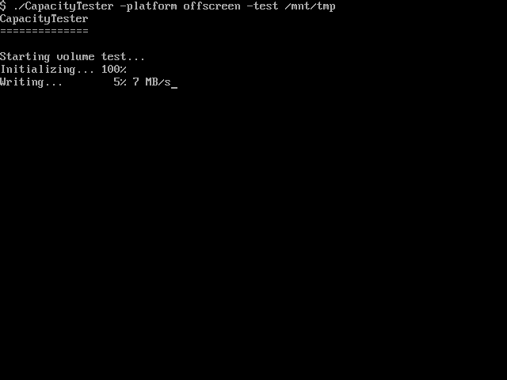

CapacityTester
==============

This tool can test your USB drive or memory card to find out if it's a fake.
For example, a fake might be sold as "64 GB USB thumbdrive"
but it would only have a real capacity of 4 GB, everything beyond this limit
will be lost. Write requests beyond that limit are often ignored without
causing an error, so a user would not be notified about the data loss.

This tool performs a simple test to determine if the full capacity
is usable or not. All it does is fill the volume with test data
and verify if the data on the volume is correct.
In order to speed things up a little, a quick test is performed during
the initilization phase, which only checks a couple of bytes
every few hundred megabytes.

The volume must be completely empty for the test to provide reliable results.

Test
----

Only mounted filesystems show up in the list,
so you have to mount your USB drive before you can test it.

Although the test is non-destructive (i.e., it won't touch existing files),
you should make sure to remove any existing files from the drive.

During the initialization phase of the test,
temporary test files are created.
With most fake flash drives, an error should be detected during this phase.
If no error is detected, a test pattern is written to the drive,
which is then read back and verified.
If you have a genuine flash drive that has become defective,
the initilization will usually finish successfully and
an error will be detected during the verification phase of the test.

After the test has finished, the temporary files are deleted automatically.
However, if the drive is removed or dies during the test,
the files will have to be deleted manually by the user.

The program does not detect and report the type of fake,
it just reports an error and where the error has occurred.
This should provide a rough estimate on the real capacity of the drive,
but no guarantees are made regarding the accuracy of the result.
Please note that because a volume test works with files on top of the
existing filesystem, it can't test every single byte of the storage device,
i.e., the first couple of bytes are used by the partition table and
are therefore inaccessible, but that's not required for detecting fakes.

Build
-----

This software requires Qt 5.4 or higher.
Make sure that the QTDIR environment variable points
to your Qt build directory.

    $ export QTDIR=~/Builds/Qt/5.5.1-GCC5.3.1-FEDORA22

Default build:

    $ make

Cleanup:

    $ make clean

Windows build:

    $ make PLATFORM=win32-g++

32-bit build:

    $ export QTDIR=... # 32-bit Qt build (-platform linux-g++-32)
    $ make rebuild-32bit
    $ make clean

Call
----

Use the libraries in your own Qt build directory if they're not installed.
If you don't have the Qt 5 libraries installed but you have a custom Qt build:

    $ LD_LIBRARY_PATH=~/Builds/Qt/5.5.1-GCC4.7.2-DEBIAN7/qtbase/lib \
      bin/CapacityTester

Call with plugin directory explicitly set (e.g., if xcb plugin missing):

    $ export QTDIR=~/Builds/Qt/5.5.1-GCC5.3.1-FEDORA22 \
      LD_LIBRARY_PATH=$QTDIR/qtbase/lib \
      QT_PLUGIN_PATH=$QTDIR/qtbase/plugins \
      bin/CapacityTester

If the program still won't start because the xcb plugin can't be loaded,
you're probably missing a library or two.
Check the dependencies of $QTDIR/qtbase/plugins/platforms/libqxcb.so
and install the missing libraries or add them manually.

Command line mode (no gui):

    $ export LD_LIBRARY_PATH=~/Builds/Qt/5.5.1-GCC4.7.2-DEBIAN7/qtbase/lib
    $ bin/CapacityTester -platform offscreen
    $ bin/CapacityTester -platform offscreen -list

Author
------

Philip Seeger (philip@philip-seeger.de)

License
-------

Please see the file called LICENSE.

