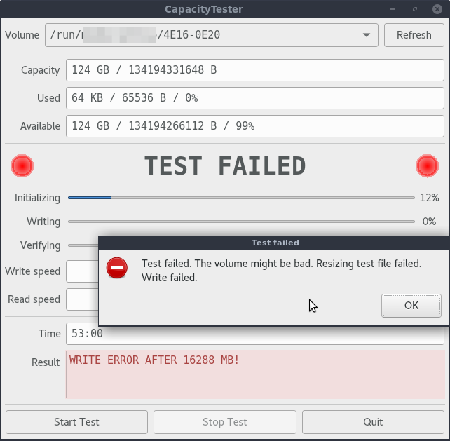

CapacityTester
==============

Have you bought a 128 GB USB flash drive (pen drive, usb stick) for $10/€10,
with "free" shipping from Asia?
If you ask something, you get a response in broken English from a Chinese guy
who's calling himself "Jennifer"...
Thinking about taxes and shipping fees, you're beginning to wonder how cheap
this particular drive is compared to one in a local shop?
Let's face it: You've probably bought a **fake flash drive**, i.e.,
one that actually has much less capacity than it claims to have.

This tool can test a USB drive or memory card to find out if it's a fake.
For example, a fake might be sold as "64 GB USB thumb drive"
but it would only have a real capacity of 4 GB, everything beyond this limit
will be lost. At that point, the fake flash drive is often rendered useless.

This tool performs a simple test to determine if the full capacity
is usable or not. All it does is fill the volume with test data (files)
and verify if the data on the volume is correct.

The volume must be completely empty (no files on it)
for the test to provide reliable results.

Note that the test runs on top of an existing filesystem,
which is sufficient to check a fake flash drive.
You could also use it to test an old hard drive
(delete all files or format it first), but that's not what it's supposed
to be used for. For an old hdd, you might want to use *badblocks*
or some other tool to test the drive itself.

The drive selection window lists all USB storage devices.
This is a Linux feature. If unavailable, all mounted filesystems are listed.

Tip: You can run this program from a Linux live system like the Fedora installer disc.

Test
----

Only mounted filesystems show up in the list,
so you have to mount your USB drive before you can test it.
You could use a file manager like Caja for that.

Although the test is non-destructive (i.e., it won't touch existing files),
you should make sure to remove any existing files from the drive.

During the initialization phase of the test,
temporary test files are created.
If the drive is defective and reports errors,
the test should abort at this stage.
After the initialization phase, a test pattern is written to the drive,
which is then read back and verified.
During the test, the drive will be completely filled up.
If you have a fake drive, the test would fail when test data
written beyond the real capacity limit is read back.
The test should also fail if a genuine drive has become defective.

After the test has finished, the temporary files are deleted automatically.
However, if the drive is removed or dies during the test,
the files will have to be deleted manually by the user.

The program does not detect and report the type of fake,
it just reports an error and where the error has occurred.
This may or may not provide an estimate on the real capacity of the drive,
but no guarantees are made regarding the accuracy of the result.

A volume test works with files on top of the filesystem of the drive,
so it does not know where each file ends up on the drive.
It depends on the filesystem where each test file is written
and how it may be fragmented.
This means that the reported offset in case of an error is a file offset,
not a physical offset and it might be much smaller than the real capacity
of a fake drive.

Many complex filesystems do not allow the full capacity to be used
as metadata and fragmentation can reduce the available capacity
once files are written.
For that reason, there is a buffer, which should be around 1 MB.
Some filesystems such as FAT32 do not need that buffer (SAFETY_BUFFER = 0).

Download
--------

There are pre-compiled executable files available for Linux
which can be downloaded from the "[Releases](https://github.com/c0xc/CapacityTester/releases)" page.

From the latest release there, under "assets", you'll find them.

If the executable file does not run because you don't have some libraries
installed, pick the AppImage file which is supposed to be portable.
The AppImage file should run on most modern Linux systems
out of the box.

A pre-compiled binary for Windows is also available,
but it's an older version of this program which did not have
the USB drive selection window yet because that's a Linux feature.

Build
-----

This software requires Qt 5.

Build using qmake:

    $ qmake
    $ make

Cleanup:

    $ make distclean

Build without qmake (alternative):
Make sure that the QTDIR environment variable points
to your Qt build directory.

    $ export QTDIR=~/Builds/Qt/5.5.1-GCC5.3.1-FEDORA22
    $ cd build
    $ make

Windows build:

    $ SET QTDIR=...
    $ cd build
    $ make PLATFORM=win32-g++

32-bit build:

    $ export QTDIR=... # 32-bit Qt build (-platform linux-g++-32)
    $ cd build
    $ make rebuild-32bit

Cleanup:

    $ cd build
    $ make clean

Call
----

Use the libraries in your own Qt build directory if they're not installed.
If you don't have the Qt 5 libraries installed but you have a custom Qt build:

    $ LD_LIBRARY_PATH=~/Builds/Qt/5.5.1-GCC4.7.2-DEBIAN7/qtbase/lib \
      bin/CapacityTester

Call with plugin directory explicitly set (e.g., if xcb plugin missing):

    $ export QTDIR=~/Builds/Qt/5.5.1-GCC5.3.1-FEDORA22 \
      LD_LIBRARY_PATH=$QTDIR/qtbase/lib \
      QT_PLUGIN_PATH=$QTDIR/qtbase/plugins \
      bin/CapacityTester

If the program still won't start because the xcb plugin can't be loaded,
you're probably missing a library or two.
Check the dependencies of $QTDIR/qtbase/plugins/platforms/libqxcb.so
and install the missing libraries or add them manually.

Command line mode (no gui):

    $ export LD_LIBRARY_PATH=~/Builds/Qt/5.5.1-GCC4.7.2-DEBIAN7/qtbase/lib
    $ bin/CapacityTester -platform offscreen
    $ bin/CapacityTester -platform offscreen -list

Author
------

Philip Seeger (philip@c0xc.net)

License
-------

Please see the file called LICENSE.

